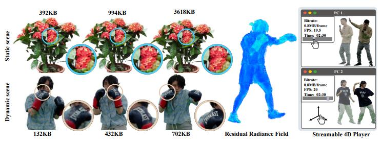

Project: [https://aoliao12138.github.io/ReRF/](https://www.youtube.com/redirect?event=video_description&redir_token=QUFFLUhqbTdiMlRtaTREWDhIMVNnMFI3d1AwV3FiRlFwd3xBQ3Jtc0trSG1xVkxPNEtBNzJnZWxMY2VBdDRrTEpqdHJMZk5XR2tfOVNKNEFLZ0dSLWJzSEZfUTVTY1dYM19QaWtzS2lKcDR6S2FYb1lVXzVUaTVOYk81bGRocjljanh2T2FLUHVlSDdTMWtiNktQT1VBSTRPWQ&q=https%3A%2F%2Faoliao12138.github.io%2FReRF%2F&v=dFvwaI1h-nc) 

Arxiv: [https://arxiv.org/abs/2304.04452](https://www.youtube.com/redirect?event=video_description&redir_token=QUFFLUhqbU5sTHM4QmdBOE0yT2tRVFZoYVBXWjhVT2RlUXxBQ3Jtc0ttaFExRGFXMWk3Y3UxN3pEMWttdE11SkVxZ3FHVTJocE5BdjZPRm9GTzlpdTdnUW1YbzlsODM1UmoyckVFWHRNcGoyS0FnbEFPaHRnS0U4S3VCNHZHeVFjNk51TEVLVHp2d1BoLUFlQmkyaVR0TDJFbw&q=https%3A%2F%2Farxiv.org%2Fabs%2F2304.04452&v=dFvwaI1h-nc)